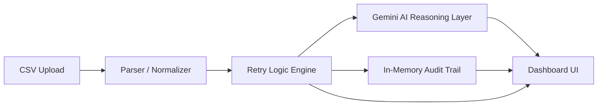

# UPI Mandate Recovery Dashboard

A React + TypeScript dashboard for exploring UPI mandate failures, simulating recovery actions, and reviewing the decision trail behind each retry recommendation.

## Problem Statement

UPI mandate failures are hard to operationalize because teams must quickly understand why a debit failed, whether it should be retried, and when a retry is safe. Manual handling introduces inconsistency, slows recovery, and makes it difficult to explain decisions to operations or finance teams.

This project addresses that by combining deterministic retry logic, AI-assisted messaging, and a lightweight dashboard for tracking mandate status, retry decisions, and audit history in one place.

## Architecture & Pipeline

The application is organized as a simple end-to-end recovery flow:

1. CSV ingestion loads mandate records from uploaded files using `papaparse`.
2. The retry-logic engine evaluates failure reasons, retry counts, and timing rules, including the 4-attempt hard cap.
3. The Gemini AI reasoning layer can draft human-friendly nudge messages for customer follow-up.
4. An in-memory audit trail records actions such as imports, nudges, and retry outcomes during the current session.
5. The dashboard UI surfaces KPIs, mandate filters, status badges, audit logs, and manual retry controls.

High-level flow:



## Setup & Installation

1. Clone the repository.

```bash
git clone <repo-url>
cd upi-mandate-recovery-dashboard
```

2. Install dependencies.

```bash
npm install
```

The app uses `papaparse` for CSV ingestion, `lucide-react` for icons, `@supabase/supabase-js` for persistence hooks, and `@google/generative-ai` for Gemini integration.

3. Create a `.env` file at the project root and set your Gemini key.

```bash
VITE_GEMINI_API_KEY=your_gemini_api_key_here
```

If you are connecting Supabase in your environment, configure the matching `VITE_SUPABASE_URL` and `VITE_SUPABASE_ANON_KEY` values as well.

4. Start the local development server.

```bash
npm run dev
```

For validation and packaging:

```bash
npm run build
npm run lint
npm run typecheck
```

## Testing & Validation

The current validation pass confirms the main recovery rule set and the project pipeline behave as expected:

- The retry engine enforces a hard cap of 4 attempts. Once a mandate reaches attempt 4 or above, it is stopped.
- The CSV ingestion path normalizes uploaded rows into mandate records before they reach the dashboard state.
- The dashboard compiles cleanly after fixing the TypeScript config and lint warnings in the retry engine.
- The pipeline sanity check covers upload, rule evaluation, AI drafting, and audit logging without introducing build or lint regressions.

Verified commands:

```bash
npm run build
npm run lint
npm run typecheck
```

## Demo Notes

- Upload a mandate CSV to seed the dashboard.
- Trigger retries to observe status transitions and audit entries.
- Open a mandate nudge to review the AI-drafted message before sending.
- Use the status filters and search to validate the retry workflow end to end.

